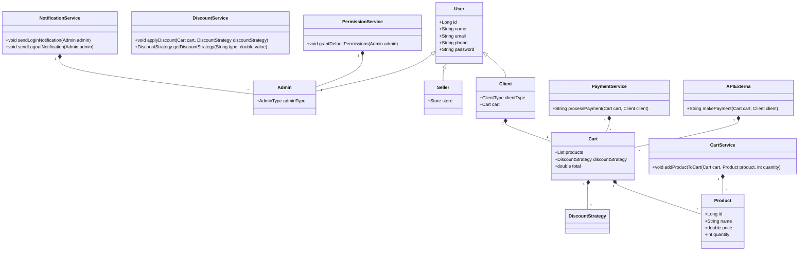
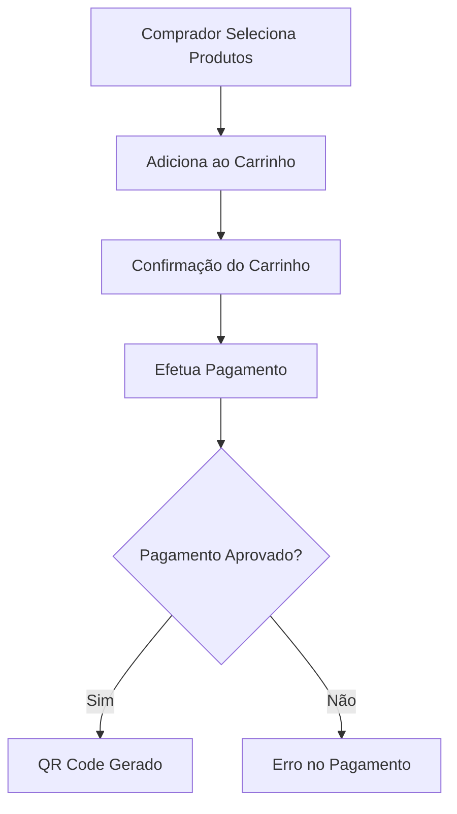
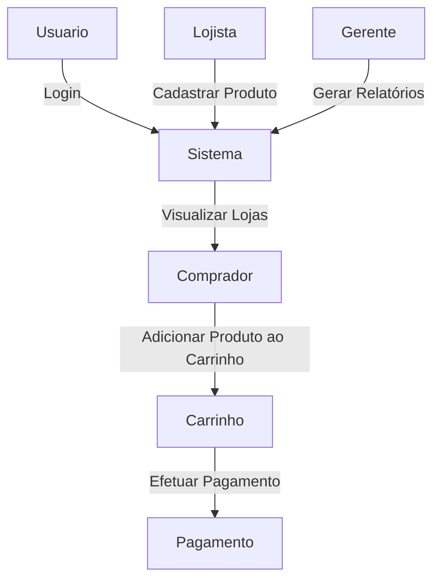
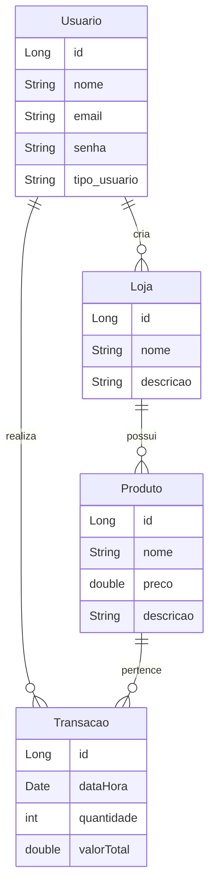
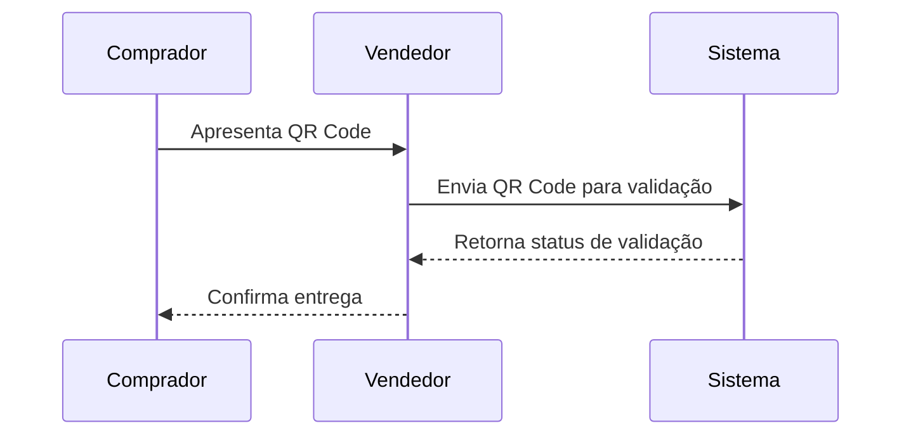
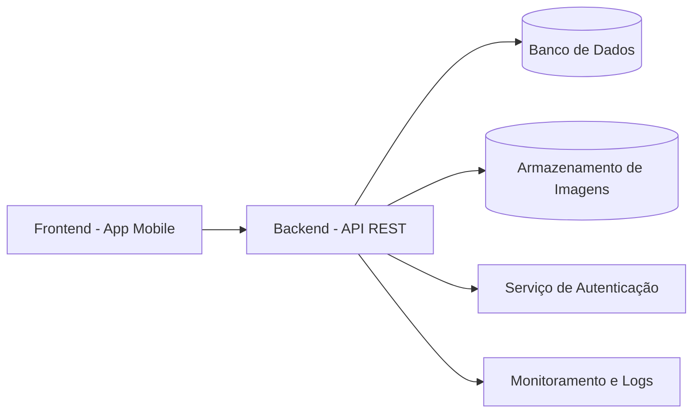
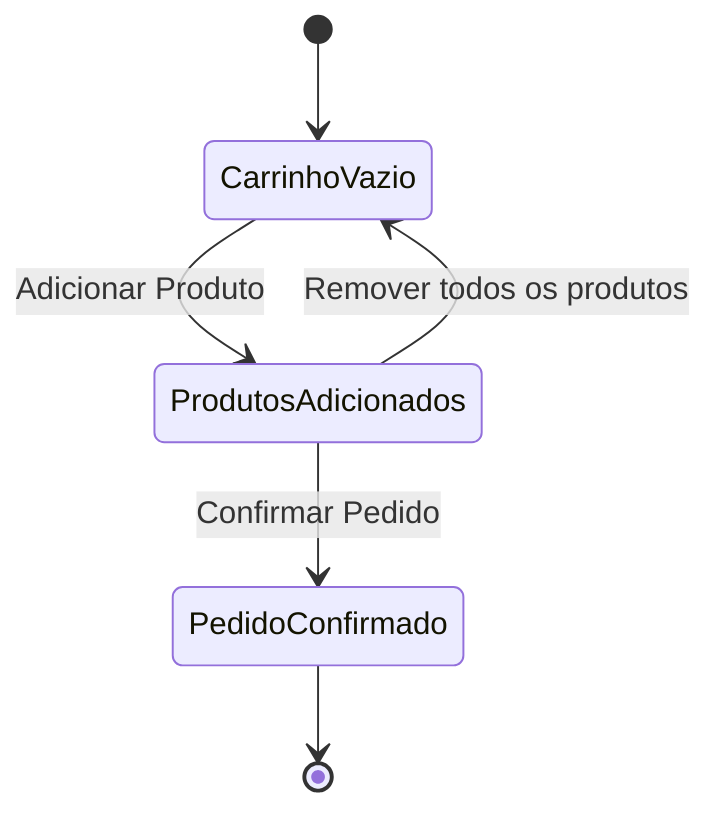
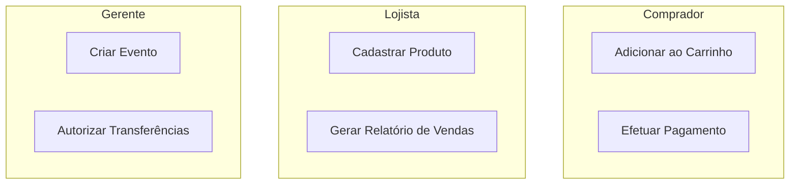
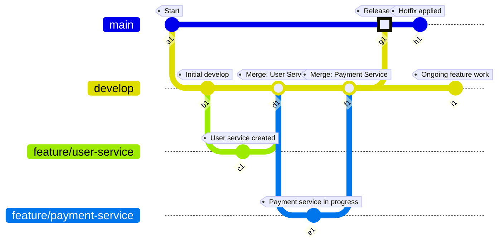
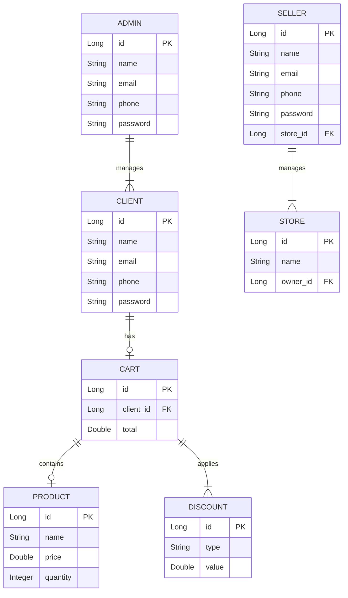

# pororoca-pagamento-api

### Diagrama de Classe


### Fluxograma
Representa processos e fluxos de trabalho. Pode ser usado para ilustrar:

O fluxo de compra do comprador.
O processo de registro e validação de usuários.



### Caso de Uso
É útil para visualizar como os diferentes usuários interagem com o sistema



### Diagrama de Entidade-Relacionamento (ERD)
Visualiza as entidades do banco de dados e seus relacionamentos.



### Diagrama de Sequência
Mostra a interação entre objetos no tempo, útil para processos como:

Validação de QR Code pelo vendedor.
Criação de relatórios pelo gerente.


### Diagrama de Componentes
Ilustra a arquitetura do sistema em termos de componentes, como microserviços, APIs, e dependências.


### Diagrama de Estado
Mostra os estados pelos quais um objeto passa, como o carrinho de compras.


### Matriz de Responsabilidade
Rastreia atividades por papel ou ator no sistema.


### GitFlow
Ótimo para planejamento e acompanhamento do desenvolvimento das funcionalidades e versões do sistema.


### Diagrama Relacional
Ótimo para compreender o fluxo das relações entre as entidades do sistema.



```mermaid

```

